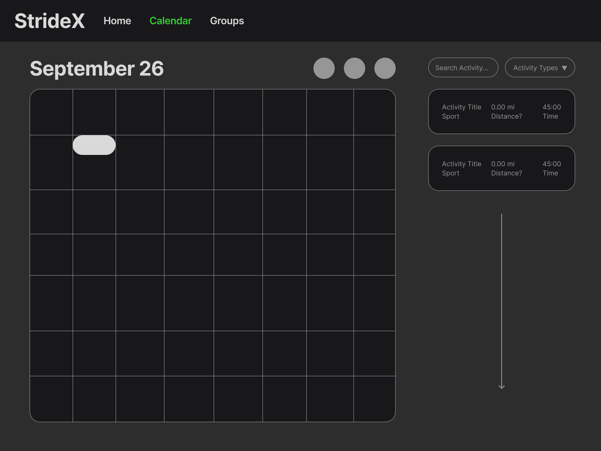
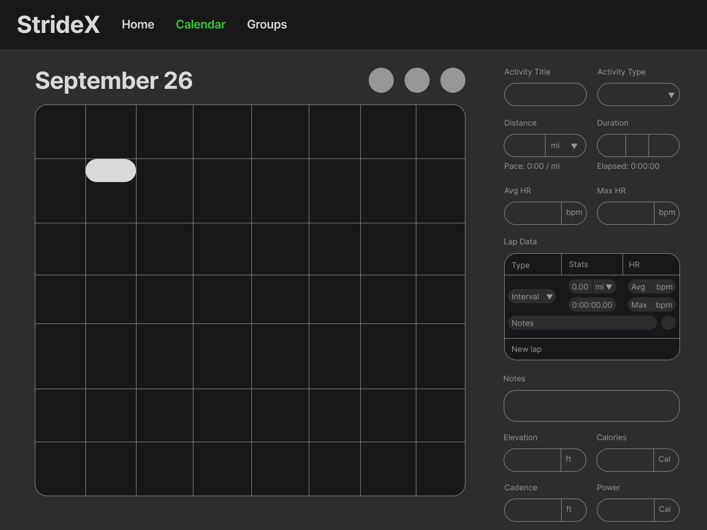

<h1>
  
  Training
</h1>

A training calendar that allows users to organize activities and coaches to view and analyze activities and data. This application is intended for athletes and coaches to track training progress and performance, as well as casual athletes who are intested in being involved in clubs.

## 🌟 Features
- 🗓️ **Training Calendar** — Users can navigate through a working calendar with a training totals column

- 🔧 **Activity Parsers** — Extracting data from .fit or .csv files for activities in json format

- 🖌️ **Custom Bootstrap Styling** — User interface is styled using modified bootstrap with StrideX branding

## 🛠️ Installation
1. Install <a href="https://nodejs.org/en/download">Node.js</a>

2. Clone the repository into desired folder:
```bash
git clone https://github.com/Etown-CS310/StrideX-Training.git
cd StrideX-Training
```

3. Install dependencies
```bash
npm install
```

## 🚀 Quick Start
1. Start the development server:
```bash
npm run dev
```

2. Open your browser and navigate to `http://localhost:5173/` to access the landing page


## User Interface



## 👤 Contributors
- Kaiden Miller - [@kaidenmiller06](https://github.com/kaidenmiller06)
- Brian Duva - [@bjduva456](https://github.com/bjduva456)
- Andrew Arvey - [@LittleDragon78](https://github.com/LittleDragon78)

## Next Steps
- User authentication and authorization
- Activity data visualization and analysis
